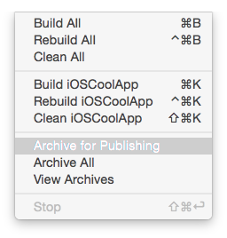
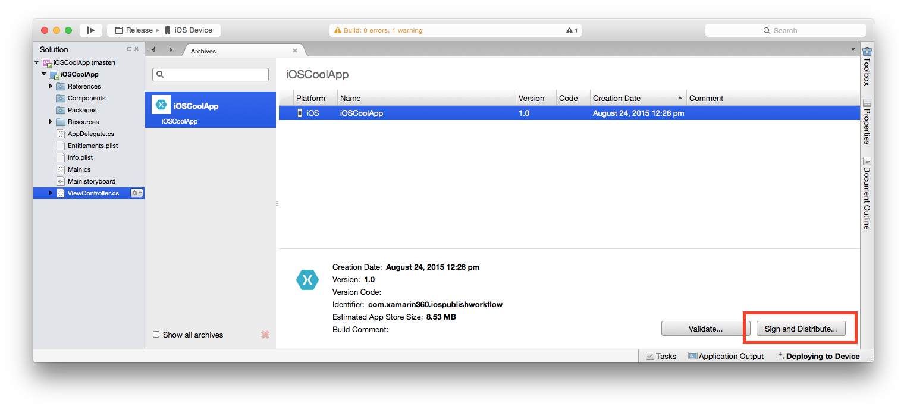
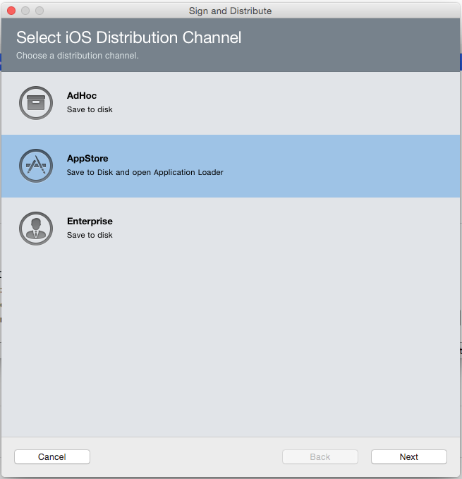
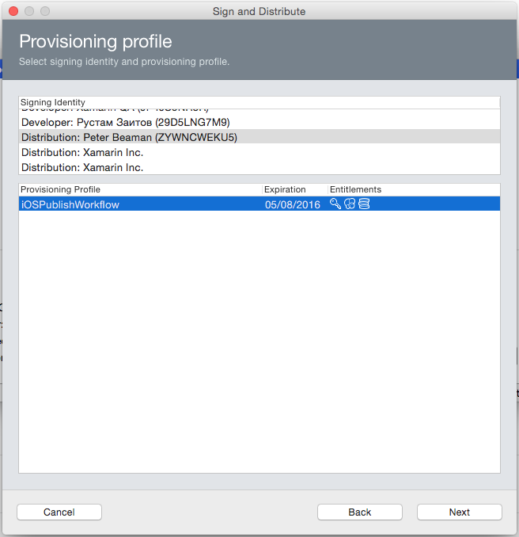
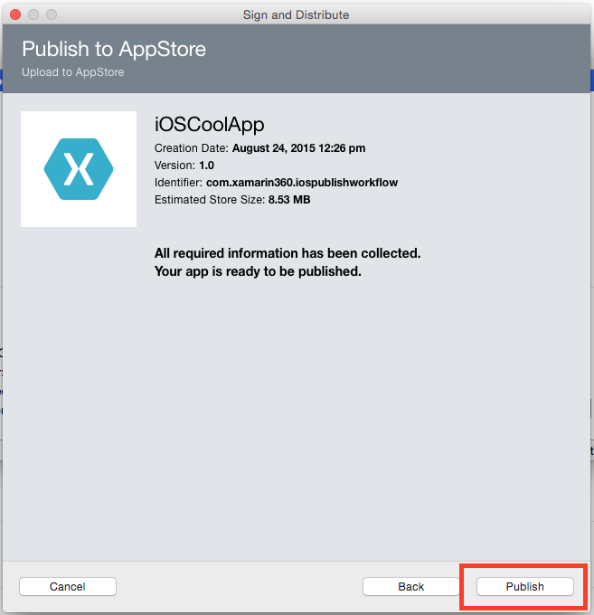
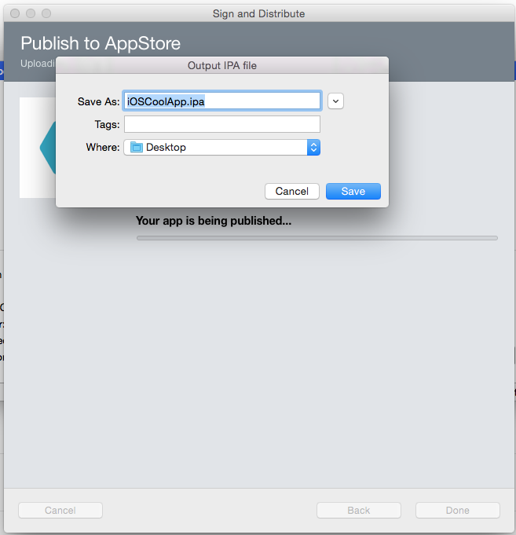
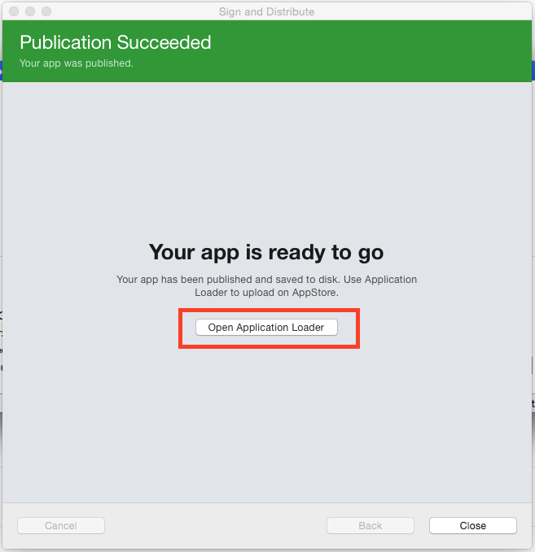
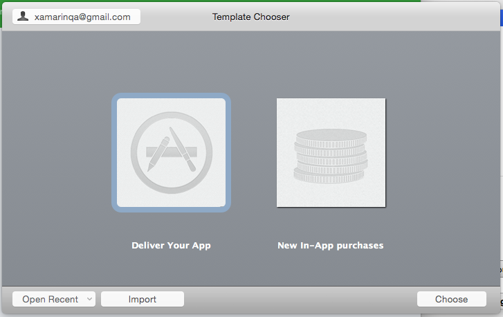
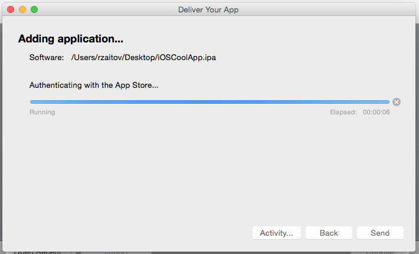
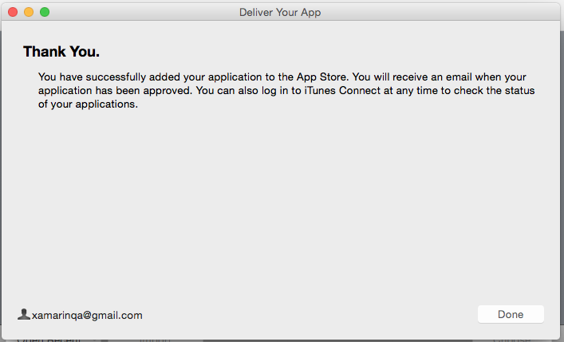

How to publish iOS App
======================
We created [iOS app](https://itunesconnect.apple.com/WebObjects/iTunesConnect.woa/ra/ng/app/1033080604/pre/builds) under iTunes Connect for you, so you don't need to create new one. At this point you can just appload binary to iTunesConnect via Xamarin or XCode.

How to upload binary via XS
---------------------------
* Open `iOSCollApp` project and choose `Release` configuration
* Increment build number via `Info.plist` file. Latest build number available in [iTunesConnect](https://itunesconnect.apple.com/WebObjects/iTunesConnect.woa/ra/ng/app/1033080604/pre/builds). E.g. `1.5` becomes `1.6`.

* Build > Archive for Publishing  

* Press `Sign and Distribute`  

* Choose `AppStore` and press `Next`  

* Select correct sign identity and provisioning profile  

* Press `Publish`  

* Select the destination folder (e.g. Desktop)  

* Launch `Application Loader`  

* Choose `Deliver your App` and press `Choose` button  

* Press `Next`  
![DeliverYourApp] (./Img/DeliverYourApp.png)

* Wait for a few minutes  

* Press `Done  

* Verify upload in [iTunes Connect](https://itunesconnect.apple.com/WebObjects/iTunesConnect.woa/ra/ng/app/1033080604/pre/builds)
